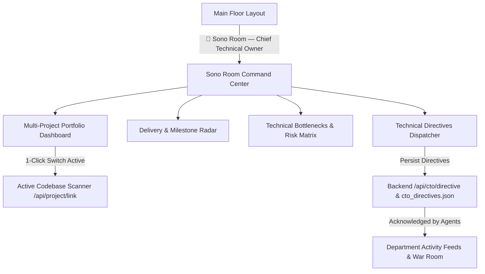

# CTO Plan: Sono Room — Chief Technical Owner Command Center

Executive cockpit for **Sono (Chief Technical Owner)** to monitor all projects across the portfolio, track delivery dates and technical bottlenecks, and dispatch authoritative technical directions to the AI agent team.

## Architecture & Features

### 1. Main Floor Integration
- **Executive Card**: `👑 Sono Room &mdash; Chief Technical Owner`
- **Sub-tag**: `Executive Engineering & Business Command &middot; Sono`
- **Telemetry Chips**: Live portfolio project count, critical blockers count, active directives count.
- **Top Bar Quick Link**: Dedicated badge in the top navigation bar for quick return to Sono Room.

### 2. Multi-Project Monitoring Dashboard
- **Live Inspection of All Portfolio Projects** in `D:\github repos` (`7rakni`, `Beast`, `Boarding pro`, `ComplyArc`, `Cup`, `EgyptSlayer`, `seo-nexus`, `Social Bomb`, etc.).
- **Key Metrics Per Project**:
  - Tech Stack detection (e.g., Tauri, Rust, TypeScript, Python, Next.js).
  - Progress percentage bar (computed from git milestones, package configuration, build scripts).
  - Target Delivery Date & Countdown (e.g., `Oct 15, 2026 — 25 days remaining`).
  - Development Stage (`Alpha`, `Beta Candidate`, `Production Ready`).
  - Last Commit message & timestamp.
  - **1-Click "Set as Active Project"**: Instantly points the incubator's 7 AI agents to any selected project for real-time analysis without manual path typing.

### 3. Technical Bottlenecks & Risk Matrix
- Live tracking of blockers categorized by severity:
  - **P0 Critical Blockers** (e.g., Local VRAM limits, missing code signing keys, uncommitted breaking changes).
  - **P1 Technical Debt** (e.g., Missing cross-platform build targets, dependency updates, unconfigured automated testing).
- Displays root cause, affected department (Engineering, R&D, Operations, Security), and recommended mitigation.

### 4. Technical Directions & Directives Dispatcher
- An interactive console allowing Sono to issue authoritative engineering guidance to the AI agents:
  - **Target Selection**: All Departments, or specific agents (`MAX` - Engineering, `SAGE` - R&D, `OTTO` - DevOps, `ARIA` - CEO).
  - **Directive Categories**: Architecture Standard, Performance & VRAM, Security & Sandboxing, Release Deadline Lock.
  - **1-Click Presets**:
    - *"Freeze external APIs: Enforce 100% offline local inference"*
    - *"Prioritize Apple Silicon Metal optimization before Windows CUDA build"*
    - *"Enforce 90% unit test coverage on core business logic"*
    - *"Protect 92% gross margin by eliminating recurring cloud egress"*
  - **Custom Directives Input**: Freeform text input for specific technical directives from Sono.
  - **Active Directives Log**: Timestamped record of directives with agent acknowledgement status, persisted via `/api/cto/directive`.

### 5. Backend Support in `server.py`
- `GET /api/cto/portfolio`: Scans all projects in `D:\github repos`, returns progress %, delivery targets, and blockers.
- `GET /api/cto/directives` & `POST /api/cto/directive`: Saves and serves directives to `cto_directives.json`.

---

## File Changes
1. [`server.py`](file:///d:/github%20repos/Sj/ai-incubator/server.py): Portfolio scanner endpoint & directive persistence.
2. [`index.html`](file:///d:/github%20repos/Sj/ai-incubator/index.html): Sono Room card on Main Floor and full `buildSonoRoom()` cockpit view.
3. [`CTO_PLAN.md`](file:///d:/github%20repos/Sj/ai-incubator/CTO_PLAN.md): Saved plan in repository.
