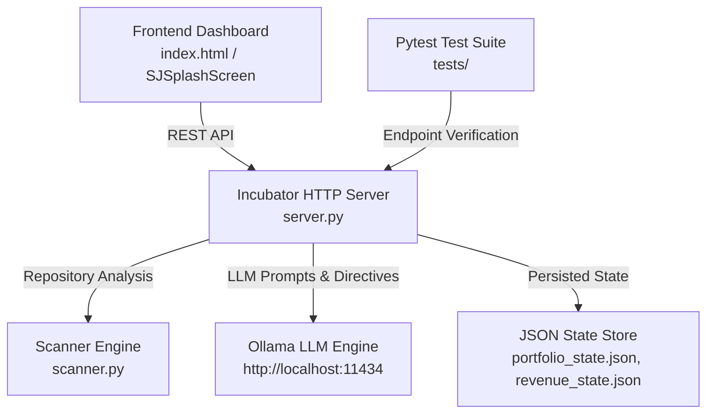

# SJ Digital Creatures — AI Incubator

An autonomous AI creature incubator, project management dashboard, and CTO agent engine for multi-tenant software portfolios.

---

## 🏛️ Architecture Overview

The system consists of five core components:



1. **Incubator HTTP Server (`server.py`)**: Standard library HTTP server providing high-performance REST API endpoints for project tracking, meeting management, CTO directives, and live revenue analytics.
2. **Scanner Engine (`scanner.py`)**: Analyzes workspace directories to auto-detect git status, project dependencies, file count, and health standing across tenants.
3. **Frontend Dashboard (`index.html`)**: Rich, modern web application providing live metrics, interactive meeting rooms, live agent interjections, and portfolio controls.
4. **AI Personnel Engine (`Ollama Integration`)**: Interoperates with local Ollama LLM instances to power CTO agent personas, automated standup directives, and decision approvals.
5. **API Test Suite (`tests/`)**: Pytest test suite ensuring reliable, continuous coverage of all GET and POST endpoint contracts.

---

## 🚀 Quickstart Commands

### Starting the Server

- **Python Direct Command**:
  ```bash
  python server.py
  ```
- **Windows Batch Launcher**:
  ```cmd
  run_server.bat
  ```
- **Background Execution (Windows VBS)**:
  ```cmd
  wscript start_background.vbs
  ```

Once started, the server listens on **`http://localhost:8080`**.

### Stopping the Server

```cmd
stop_server.bat
```

### Running the Test Suite

Execute all endpoint test suites using `pytest`:

```bash
python -m pytest tests/
```

Or using standard `unittest`:

```bash
python -m unittest discover -s tests
```

---

## ⚙️ Setup Instructions

### Prerequisites

- **Python**: 3.10 or higher
- **Pytest**: (Optional, for running test suites)
- **Ollama**: (Optional, required for live AI personnel chat & directives)

### Installation

1. **Clone the repository**:
   ```bash
   git clone https://github.com/Amrsono/SJ-Digital-Creatures.git
   cd SJ-Digital-Creatures/ai-incubator
   ```

2. **Configure Environment Variables**:
   Copy the provided `.env.example` template to `.env`:
   ```bash
   cp .env.example .env
   ```

3. **Install Pytest (Optional for testing)**:
   ```bash
   python -m pip install pytest
   ```

---

## 🔌 Core API Endpoints

| Category | Method | Endpoint | Description |
| :--- | :--- | :--- | :--- |
| **Project** | `GET` | `/api/project/current` | Returns details for the active project. |
| **Project** | `GET` | `/api/projects/recent` | Lists recently accessed projects. |
| **Portfolio** | `GET` | `/api/portfolio/state` | Returns active portfolio tenants and count. |
| **CTO Agent** | `GET` | `/api/cto/directives` | Retrieves the history of CTO directives. |
| **CTO Agent** | `GET` | `/api/cto/approvals` | Retrieves CTO decision approvals. |
| **Meeting** | `GET` | `/api/meeting/data` | Retrieves meeting state and agenda. |
| **Meeting** | `POST` | `/api/meeting/convene` | Convenes a new team meeting session. |
| **Meeting** | `POST` | `/api/meeting/interject` | Submits an interjection into the live meeting room. |
| **Meeting** | `POST` | `/api/meeting/clear` | Clears the active meeting session history. |
| **Revenue** | `GET` | `/api/revenue/metrics` | Fetches live revenue metrics, live projects, and recent transactions. |
| **Engine** | `GET` | `/api/engine/status` | Reports autonomous engine status and health metrics. |
